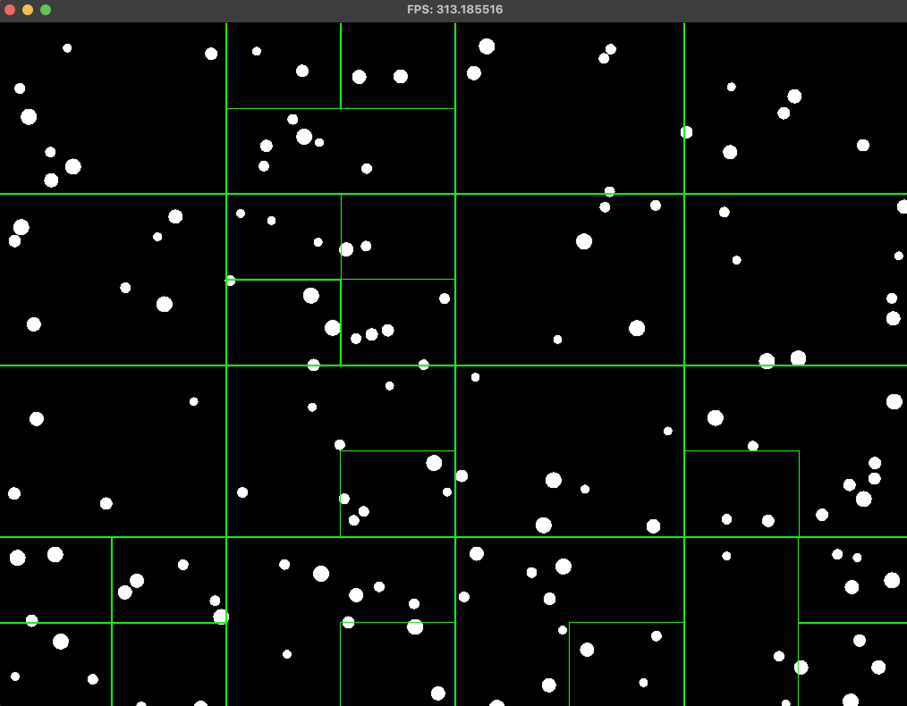

# Ball Collision



## Overview
You can find full description here: [EagleDynamics](https://github.com/EagleDynamics/interview/tree/main)

## Architecture

Used simplified ECS without Components, because currently we
have only 1 type of objects: circles.

## Checking Intersection

Intersection is checked by formula (without using sqrt):

```C++
float distanceSqr = Math::Vector2dUtils::getDistanceSqr(ball1.position, ball2.position);
float radiusSum = ball1.radius + ball2.radius;
return distanceSqr < radiusSum * radiusSum;
```

For optimization, I use [Quadtree](https://en.wikipedia.org/wiki/Quadtree) with O(n log n). However, this task also could be solved
by using [spatial hash](https://www.gamedev.net/tutorials/programming/general-and-gameplay-programming/spatial-hashing-r2697/) for example.

## Elastic collision

```C++
float a_mass = a.radius * a.radius;
    float b_mass = b.radius * b.radius;

    sf::Vector2f relativeVelocity = Math::Vector2dUtils::getFromToVec(a.velocity, b.velocity);
    sf::Vector2f relativePosition = Math::Vector2dUtils::getDistanceUnitVec(a.position, b.position);

    float velocityAlongNormal = Math::Vector2dUtils::dotProduct(relativeVelocity, relativePosition);
    if (velocityAlongNormal > 0) {
        return;
    }

    float e = 1.0; // Coefficient of restitution

    float j = -(1 + e) * velocityAlongNormal;
    j /= 1 / a_mass + 1 / b_mass;

    // Apply impulse
    sf::Vector2f impulse = relativePosition * j;
    a.velocity -= impulse / a_mass;
    b.velocity += impulse / b_mass;
```

## Debug Quadtree

Due to poor optimization I turned off quadtree draw by default.
You can enable debug draw of quadtree by uncommenting 1 line at src/engine/Game.cpp
```C++
void Game::initSystems() {
    systems_.push_back(std::make_unique<DrawSystem>(window_.get(), world_.get()));
    systems_.push_back(std::make_unique<FpsDebugSystem>(window_.get(), world_.get()));
    systems_.push_back(std::make_unique<MovementSystem>(world_.get()));
    systems_.push_back(std::make_unique<CollisionSystem>(window_.get(), world_.get()));
    // Warning: DrawCollisionSystem is highly unoptimized. Should be used only for debug purposes.
    // Uncomment line below to see quadtree
    //systems_.push_back(std::make_unique<DrawCollisionSystem>(window_.get(), world_.get()));
}
```

## Visual Studio build

In case of using Visual Studio, you can build the project for Visual Studio by using command:
```Shell
cmake -G "Visual Studio 10"
```